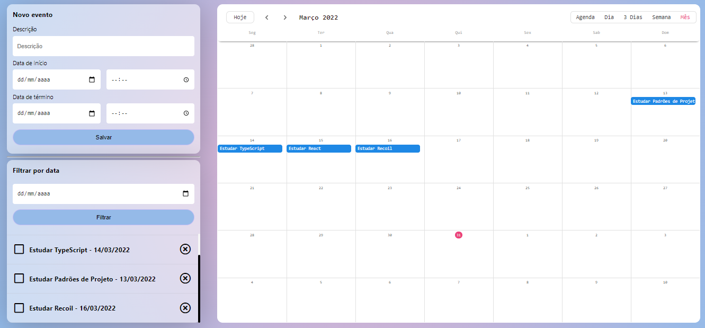

<h1 align="center">
  
</h1>

# Curso - React: gerenciando estado com Recoil

Curso ministrado por Marcos Vinicios da Silva Neves

## Atoms

Atoms são unidades de estado, é possível atualizar e ler estes estados de uma forma fácil.

É possível conectar seus components a estes Atoms para que quando eles sejam atualizados os components sejam renderizados novamente.

Ao invés dos estados locais dos components, podemos utilizar atoms para compartilhar os estados entre muitos components.

### Acessar atoms

Nós utilizamos o hook `useRecoilValue` para ter acesso à lista de eventos.

### Modificar atoms

Nós utilizamos o hook `useSetRecoilState` para adicionar novos itens à lista de eventos.

Manipulamos o hook com o useSetRecoilState, ele funciona da mesma forma que o useState e nos retorna o getter e o setter.
Ex: ` const [tamanhoDaFonte, setTamanhoDaFonte] = useRecoilState<number>(tamanhoDaFonteState)`

## Selectors

Os Selectors sâo funções puras (que tem como objetivo devolver valores derivados dos Atoms) que recebem um Atom como argumento, quando o Atom que veio como argumento é atualizado o selector também atualiza o valor de retorno.

Assim como no caso dos Atoms, os Components também podem se ‘inscrever’ para serem avisados quando os selectors forem atualizados, quando isso acontece eles são renderizados novamente.

## Seletores Async e Depuração

Criamos um seletor assíncrono
chamado eventosAsync que faz a busca de eventos.

Indicamos valores padrões para o átomo, no caso da lista de eventos, por padrão ela recebe o valor assíncrono do seletor.

Observamos alterações no estado com o componente `DebugObserver`

## Remover eventos do estado

Removemos utilizando o método filter.

indexOf: para obter um determinado índice de um elemento num array.

slice: para remover, a partir de um índice, uma quantidade N de elementos.
Atualizar um evento específico

## Hook customizado

Criamos um hook reaproveitável e responsável por atualizar um evento, inclusive encapsulando o recoil.

## onEventDragFinish

Usamos o método `onEventDragFinish` para que toda vez que eu mudasse um evento de posição no calendário, a datas desses eventos fossem atualizados.

## Diminuir o acoplamento da aplicação

Ao extrair a comunicação com o recoil em hooks, estamos desacoplados da lib em si.

Se trocarmos por qualquer outra solução, estaremos prontos. Só precisamos alterar os hooks, e não os componentes.

## Aumentar a coesão

Ao remover a responsabilidade de alterar o estado para os hooks, nossos componentes ficam mais coesos e não precisam se preocupar com as implementações relacionadas a manipular o estado.

## Suspense

O componente `Suspense` do React permite inserir efeitos colaterais declarativamente dentro de qualquer elemento na árvore de componentes a partir do momento que você jogar uma Promise na sua pilha de chamadas atuais.

Ajuda a lidar com operações assíncronas, permitindo que você aguarde o carregamento de algum código e especifique um estado de carregamento (como um spinner) enquanto espera.

O Suspense também pode ser usado para buscar outros recursos como imagens, scripts ou outros trabalhos assíncronos.

## Json Server

O servidor JSON é um módulo de nó que você pode usar para criar serviços JSON REST de demonstração em um curto período de tempo.

Para rodar ele, adicionamos algumas configurações no package.json, então é só usar o `npm run server`.

Usamos ele para fazer uma demonstração de requisições assíncronas.

---

Rode `npm run server` para rodar o json server e o `npm start` para rodar a aplicação.

Aplicação do instrutor encontra-se no [github de viniciosneves](https://github.com/alura-cursos/event-tracker)
